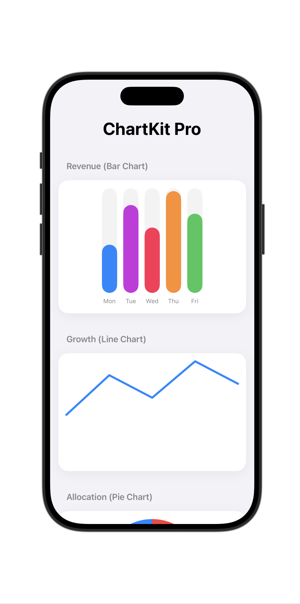

# ChartKit

[](https://swiftpackageindex.com/ErsanQ/ChartKit)
[](https://swiftpackageindex.com/ErsanQ/ChartKit)

A beautiful, simple, and lightweight charting library for SwiftUI. Create stunning Bar, Line, and Pie charts with zero boilerplate.



## Features
- **Simplified API**: Just pass an array of `ChartData` and you're good to go.
- **BarChart**: Vertical bars with smooth spring animations.
- **LineChart**: Fluid, curved paths to visualize sequences and growth.
- **PieChart**: Segmented circles with percentage-based slices.
- **Lightweight**: Zero external dependencies, built entirely with native SwiftUI Shapes.
- **Backward Compatible**: Supports iOS 14.0+ and macOS 11.0+.

## Installation

```swift
.package(url: "https://github.com/ErsanQ/ChartKit", from: "1.0.4")
```

## Usage

### Define Your Data
```swift
let data = [
    ChartData(label: "Mon", value: 45, color: .blue),
    ChartData(label: "Tue", value: 82, color: .purple),
    ChartData(label: "Wed", value: 61, color: .pink)
]
```

### Display a Chart
```swift
BarChart(data: data)
LineChart(data: data, color: .blue)
PieChart(data: data)
```

## Example
Check out `Sources/ChartKit/Examples/ChartExampleView.swift` for a full implementation demonstrating all chart types.

## License
MIT License.

## Author
ErsanQ (Swift Package Index Community)
